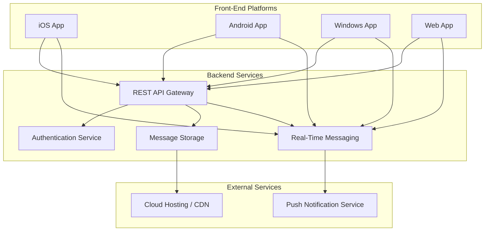

# Multiplaform Chat

```mermaid
graph TD
    subgraph Front-End Platforms
        A1[iOS App]
        A2[Android App]
        A3[Windows App]
        A4[Web App]
    end

    subgraph Backend Services
        B1[Authentication Service]
        B2[Message Storage]
        B3[Real-Time Messaging]
        B4[REST API Gateway]
    end

    subgraph External Services
        C1[Push Notification Service]
        C2[Cloud Hosting / CDN]
    end

    %% Connections from Front-End to Backend
    A1 --> B4
    A2 --> B4
    A3 --> B4
    A4 --> B4

    %% Backend Internal Connections
    B4 --> B1
    B4 --> B2
    B4 --> B3

    %% Real-Time Messaging
    A1 --> B3
    A2 --> B3
    A3 --> B3
    A4 --> B3

    %% Backend to External Services
    B3 --> C1
    B2 --> C2
```
